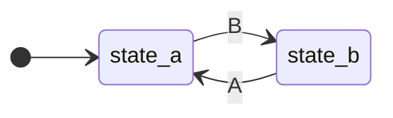
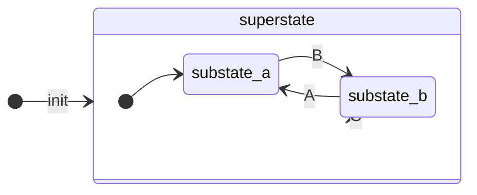
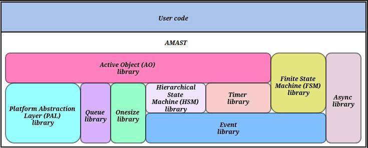

[](LICENSE)
[](https://github.com/adel-mamin/amast/releases)
[](https://amast.readthedocs.io/)


# Amast

## Introduction
<a name="introduction"></a>

Amast is a minimalist asynchronous toolkit to help developing projects with asynchronous interactions and state machines.
Written in C99.

## What is it useful for?

Here are several use cases in increasing level of complexity.

### Finite state machine (FSM)

The FSM has two states:


```mermaid
stateDiagram-v2
    direction LR

    [*] --> state_a

    state_a --> state_b : B
    state_b --> state_a : A
```

Here is the full implementation of the FSM:

```C
#include "amast_config.h"
#include "amast.h"

#define EVT_A AM_EVT_USER
#define EVT_B (AM_EVT_USER + 1)

struct app {
    struct am_fsm fsm;
    /* app data */
} app;

static enum am_rc state_b(struct app *me, const struct am_event *event);

static enum am_rc state_a(struct am_fsm *fsm, const struct am_event *event) {
    struct app* me = AM_CONTAINER_OF(fsm, struct app, fsm);
    switch (event->id) {
    case AM_EVT_ENTRY:
        am_printf("state_a entry\n");
        return am_fsm_handled(fsm);

    case AM_EVT_EXIT:
        am_printf("state_a exit\n");
        return am_fsm_handled(fsm);

    case EVT_B:
        return am_fsm_tran(fsm, state_b);
    }
    return am_fsm_handled(fsm);
}

static enum am_rc state_b(struct am_fsm *fsm, const struct am_event *event) {
    struct app* me = AM_CONTAINER_OF(fsm, struct app, fsm);
    switch (event->id) {
    case AM_EVT_ENTRY:
        am_printf("state_b entry\n");
        return am_fsm_handled(fsm);

    case AM_EVT_EXIT:
        am_printf("state_b exit\n");
        return am_fsm_handled(fsm);

    case EVT_A:
        return am_fsm_tran(fsm, state_a);
    }
    return am_fsm_handled(fsm);
}

static enum am_rc init(struct am_fsm *fsm, const struct am_event *event) {
    return am_fsm_tran(fsm, state_a);
}

int main(void) {
    am_fsm_create(&app.fsm, init);
    am_fsm_init(&app.fsm, /*init_event=*/NULL);
    am_fsm_dispatch(&app.fsm, &(struct am_event){.id = EVT_B});
    am_fsm_dispatch(&app.fsm, &(struct am_event){.id = EVT_A});
    return 0;
}
```

The console output:

```
state_a entry
state_a exit
state_b entry
state_b exit
state_a entry
```

The FSM API can be found [here](https://amast.readthedocs.io/api.html#fsm).
The FSM documenation is [here](https://amast.readthedocs.io/fsm.html).

The compiled binary on x86 is about 2.4kB of memory (gcc, `-Os`, `-flto`).

### Hierarchical state machine (HSM)

The HSM has two sub-states and one superstate.

It demonstrates:

1. creating of hierarchy of states
2. behavioral inheritance by handling the event C in superstate


```mermaid
stateDiagram-v2
    direction LR

    [*] --> superstate : init

    state superstate {
        [*] --> substate_a

        substate_a --> substate_b : B
        substate_b --> substate_a : A
    }

    superstate --> substate_b : C
```

Here is the full implementation of the HSM:

```C
#include <stdio.h>

#include "amast_config.h"
#include "amast.h"

enum { APP_EVT_A = AM_EVT_USER, APP_EVT_B, APP_EVT_C };

struct app {
    struct am_hsm hsm;
    /* app data */
} app;

static enum am_rc substate_a(struct am_hsm* hsm, const struct am_event *event);
static enum am_rc substate_b(struct am_hsm* hsm, const struct am_event *event);

static enum am_rc superstate(struct am_hsm* hsm, const struct am_event *event) {
    struct app* me = AM_CONTAINER_OF(hsm, struct app, hsm);
    switch (event->id) {
    case AM_EVT_ENTRY:
        am_printf("superstate entry\n");
        return am_hsm_handled(hsm);

    case AM_EVT_EXIT:
        am_printf("superstate exit\n");
        return am_hsm_handled(hsm);

    case AM_EVT_INIT:
        return am_hsm_tran(hsm, substate_a);

    case APP_EVT_C:
        return am_hsm_tran(hsm, substate_b);
    }
    return am_hsm_super(am_hsm_top);
}

static enum am_rc substate_a(struct am_hsm* hsm, const struct am_event *event) {
    struct app* me = AM_CONTAINER_OF(hsm, struct app, hsm);
    switch (event->id) {
    case AM_EVT_ENTRY:
        am_printf("substate_a entry\n");
        return am_hsm_handled(hsm);

    case AM_EVT_EXIT:
        am_printf("substate_a exit\n");
        return am_hsm_handled(hsm);

    case APP_EVT_B:
        return am_hsm_tran(hsm, substate_b);
    }
    return am_hsm_super(hsm, superstate);
}

static enum am_rc substate_b(struct am_hsm* hsm, const struct am_event *event) {
    struct app* me = AM_CONTAINER_OF(hsm, struct app, hsm);
    switch (event->id) {
    case AM_EVT_ENTRY:
        am_printf("substate_b entry\n");
        return am_hsm_handled(hsm);

    case AM_EVT_EXIT:
        am_printf("substate_b exit\n");
        return am_hsm_handled(hsm);

    case APP_EVT_A:
        return am_hsm_tran(hsm, substate_a);
    }
    return am_hsm_super(hsm, superstate);
}

static enum am_rc init(struct am_hsm* hsm, const struct am_event *event) {
    return am_hsm_tran(hsm, superstate);
}

int main(void) {
    am_hsm_create(&app.hsm, am_hsm_state(init));
    am_hsm_init(&app.hsm, /*init_event=*/NULL);
    am_hsm_dispatch(&app.hsm, &(struct am_event){.id = APP_EVT_B});
    am_hsm_dispatch(&app.hsm, &(struct am_event){.id = APP_EVT_A});
    am_hsm_dispatch(&app.hsm, &(struct am_event){.id = APP_EVT_C});
    return 0;
}
```

The console output:

```
superstate entry
substate_a entry
substate_a exit
substate_b entry
substate_b exit
substate_a entry
substate_a exit
substate_b entry
```

The HSM API can be found [here](https://amast.readthedocs.io/api.html#hsm).
The HSM documenation is [here](https://amast.readthedocs.io/hsm.html).

The compiled binary on x86 is about 4.0kB of memory (gcc, `-Os`, `-flto`).

### Active Object

Here is a full implementation of one active object with two states.

It demonstrates:

1. creating the active object
2. creating and maintaining a timer
3. event publishing
4. creating regular tasks, for blocking calls like
   sleep and waiting for user input

```C
#include <stdio.h>
#include <stddef.h>
#include <string.h>

#include "amast_config.h"
#include "amast.h"

enum {
    APP_EVT_SWITCH_MODE = AM_EVT_USER,
    APP_EVT_PUB_MAX,
    APP_EVT_TIMER,
};

struct app {
    struct am_hsm hsm;
    struct am_ao ao;
    struct am_timer *timer;
    struct am_timer_event_x timeout;
    int ticks;
};

static enum am_rc app_state_a(struct am_hsm* hsm, const struct am_event *event);
static enum am_rc app_state_b(struct am_hsm* hsm, const struct am_event *event);

static enum am_rc app_state_a(struct am_hsm* hsm, const struct am_event *event) {
    switch (event->id) {
    case AM_EVT_ENTRY:
        am_printf("state A\n");
        return am_hsm_handled(hsm);

    case APP_EVT_SWITCH_MODE:
        return am_hsm_tran(hsm, app_state_b);
    }
    return am_hsm_super(hsm, am_hsm_top);
}

static enum am_rc app_state_b(struct am_hsm* hsm, const struct am_event *event) {
    struct app* me = AM_CONTAINER_OF(hsm, struct app, hsm);
    switch (event->id) {
    case AM_EVT_ENTRY:
        am_printf("state B\n");
        am_timer_arm(me->timer, &me->timeout.event, me->ticks, /*interval=*/0);
        return am_hsm_handled(hsm);

    case AM_EVT_EXIT:
        am_timer_disarm(me->timer, &me->timeout.event);
        return am_hsm_handled(hsm);

    case APP_EVT_SWITCH_MODE:
        return am_hsm_tran(hsm, app_state_a);

    case APP_EVT_TIMER:
        am_printf("timer\n");
        am_timer_arm(me->timer, &me->timeout.event, me->ticks, /*interval=*/0);
        return am_hsm_handled(hsm);
    }
    return am_hsm_super(hsm, am_hsm_top);
}

static enum am_rc app_init(struct am_hsm* hsm, const struct am_event *event) {
    struct app* me = AM_CONTAINER_OF(hsm, struct app, hsm);
    am_ao_subscribe(&me->ao, APP_EVT_SWITCH_MODE);
    return am_hsm_tran(hsm, app_state_a);
}

static void app_create(struct app *me, struct am_timer *timer) {
    memset(me, 0, sizeof(*me));
    am_ao_create(&me->ao, (am_ao_fn)am_hsm_init, (am_ao_fn)am_hsm_dispatch, me);
    am_hsm_create(&me->hsm, am_hsm_state(app_init));
    me->timer = timer;
    me->timeout = am_timer_event_create_x(APP_EVT_TIMER, &me->ao);
    me->ticks = am_time_get_ticks_from_ms(AM_TIMEBASE_DEFAULT, 1000);
}

static void ticker_cb(void* param) {
    struct am_timer* timer = param;

    am_timer_tick_iterator_init(timer);
    struct am_timer_event* fired = NULL;
    while ((fired = am_timer_tick_iterator_next(timer)) != NULL) {
        void* owner = AM_CAST(struct am_timer_event_x*, fired)->ctx;
        if (owner) {
            am_ao_post_fifo(owner, &fired->event);
        } else {
            am_ao_publish(&fired->event);
        }
    }
}

static void input_task(void *param) {
    int ch;
    while ((ch = getc(stdin)) != EOF) {
        if ('\n' == ch) {
            static struct am_event event = {.id = APP_EVT_SWITCH_MODE};
            am_ao_publish(&event);
        }
    }
}

int main(void) {
    am_pal_create(/*arg=*/NULL);

    struct am_timer timer;
    am_timer_create(&timer);

    /* event publish/subscribe memory */
    struct am_event_subscribe_list pubsub_list[APP_EVT_PUB_MAX];
    am_event_async_init(pubsub_list, AM_COUNTOF(pubsub_list), /*alloc=*/NULL);

    struct am_ao_state_cfg cfg = {
        .crit_enter = am_crit_enter, .crit_exit = am_crit_exit
    };
    am_ao_state_create(&cfg);

    struct app m;
    app_create(&m, &timer);

    /* active object incoming events queue */
    const struct am_event *m_queue[2];

    am_ao_start(
        &m.ao,
        (struct am_ao_prio){.ao = AM_AO_PRIO_MAX, .task = AM_AO_PRIO_MAX},
        /*queue=*/m_queue,
        /*queue_size=*/AM_COUNTOF(m_queue),
        /*stack=*/NULL,
        /*stack_size=*/0,
        /*name=*/"app",
        /*init_event=*/NULL
    );

    /* user input controlling thread */
    am_task_create(
        "input",
        AM_AO_PRIO_MIN,
        /*stack=*/NULL,
        /*stack_size=*/0,
        /*init=*/NULL,
        /*entry=*/input_task,
        /*flags=*/AM_TASK_FLAG_WAIT_INIT,
        /*arg=*/&m
    );

    int ticker = am_ticker_create(&(struct am_ticker_cfg){
        .timebase = AM_TIMEBASE_DEFAULT,
        .ticker_cb = ticker_cb,
        .ctx = &timer,
        .priority_hint = AM_AO_PRIO_MIN,
    });
    am_ticker_start(ticker);

    while (am_ao_get_cnt() > 0) {
        am_ao_run_all();
    }

    am_ticker_stop(ticker);

    am_ao_state_destroy();

    am_pal_destroy();

    return 0;
}
```

The AO API can be found [here](https://amast.readthedocs.io/api.html#ao).
The Event API can be found [here](https://amast.readthedocs.io/api.html#event).
The Timer API can be found [here](https://amast.readthedocs.io/api.html#timer).

The compiled binary on x86 is about 10.6kB of memory (gcc, `-Os`, `-flto`).

## Architecture Diagram



## What Is Inside

Library name | Description
-------------|------------
ao | active object (preemptive and cooperative) ([documentation](https://github.com/adel-mamin/amast/blob/main/libs/ao/README.rst), [example](https://github.com/adel-mamin/amast/tree/main/apps/examples/dpp))
async | async/await ([documentation](https://github.com/adel-mamin/amast/blob/main/libs/async/README.rst), [example](https://github.com/adel-mamin/amast/tree/main/apps/examples/async))
dlist | doubly linked list
event | events ([documentation](https://github.com/adel-mamin/amast/blob/main/libs/event/README.rst))
fsm | finite state machine (FSM) ([documentation](https://github.com/adel-mamin/amast/blob/main/libs/fsm/README.rst))
hsm | hierarchical state machine (HSM) with sub-machines support ([documentation](https://github.com/adel-mamin/amast/blob/main/libs/hsm/README.rst), [examples](https://github.com/adel-mamin/amast/tree/main/apps/examples/hsm))
onesize | onesize memory allocator ([documentation](https://github.com/adel-mamin/amast/blob/main/libs/onesize/README.rst))
ringbuf | ring buffer ([documentation](https://github.com/adel-mamin/amast/blob/main/libs/ringbuf/README.rst), [example](https://github.com/adel-mamin/amast/tree/main/apps/examples/ringbuf))
slist | singly linked list
timer | timers ([documentation](https://github.com/adel-mamin/amast/blob/main/libs/timer/README.rst))

## How Big Are Compile Sizes

Some x86-64 size figures to get an idea:

<!--
Generated by disabling `-ftrav`, address and undefined sanitizers.
Meson build type is set to `minsize`.
LTO is disabled.
-->

Library name | Code size [kB] | Data size [kB]
-------------|----------------|---------------
ao_cooperative | 3.61 | 0.57
ao_preemptive | 3.55 | 0.56
dlist | 1.29 | 0.00
event | 4.00 | 0.23
fsm | 0.88 | 0.00
hsm | 2.66 | 0.01
onesize | 1.43 | 0.00
ringbuf | 1.55 | 0.00
slist | 1.21 | 0.00
timer | 1.03 | 0.08

## How To Compile For Amast Development
<a name="how-to-compile"></a>

On Linux or WSL:

Install [pixi](https://pixi.sh/latest/#installation).
Run `pixi run all`.

## How To Use The Latest Amast Release
<a name="how-to-use"></a>

Include

- `amast.h`
- `amast_config.h`
- `amast.c`
- `amast_preemptive.c` or `amast_cooperative.c`

from the latest release to your project.

If you want to use Amast features that require porting, then also add the following
port to you project:

- `amast_posix.c`
- `amast_libuv.c`

If you want to run Amast unit tests, then also include `amast_test.h` and `amast_test.c`.

`Makefile` is available for optional use. Run `make test` to run the unit tests.

## Features, Bugs, etc.

The project uses "Discussions" instead of "Issues".

"Discussions" tab has different discussion groups for "Features" and "Bugs".

For making sure issues are addressed, both me and the community can better evaluate which issues and features are high priority because they can be "upvoted".

## How To Contribute

If you find the project useful, then please star it. It helps promoting it.

If you find any bugs, please report them.

## License
<a name="license"></a>

Amast is open-sourced software licensed under the [MIT license](LICENSE.md).

## Star History

[](https://star-history.com/#adel-mamin/amast&Date)
