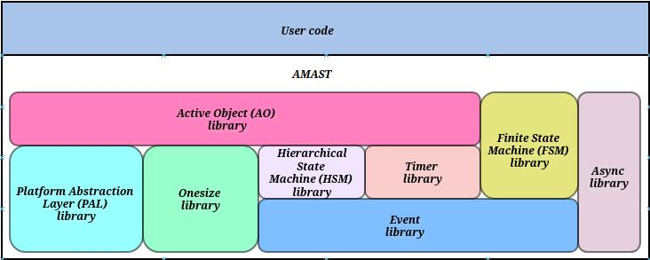

[](LICENSE)
[](https://github.com/adel-mamin/amast/releases)
[](https://amast.readthedocs.io/)


# Amast

## Introduction
<a name="introduction"></a>

Amast is a minimalist asynchronous toolkit to help developing projects with asynchronous intractions and state machines.
Written in C99.

## What is it useful for?

Here are several usecases in increasing level of complexity.

### Finite state machine (FSM)

The FSM has two states:


Here is the full implementation of the FSM:

```C
struct app {
    struct am_fsm fsm;
    /* app data */
} app;

static enum am_rc state_a(struct app *me, const struct am_event *event) {
    switch (event->id) {
    case AM_EVT_FSM_ENTRY: break;
    case AM_EVT_FSM_EXIT: break;
    case AM_EVT_B: return AM_FSM_TRAN(state_b);
    }
    return AM_FSM_HANDLED();
}

static enum am_rc state_b(struct app *me, const struct am_event *event) {
    switch (event->id) {
    case AM_EVT_FSM_ENTRY: break;
    case AM_EVT_FSM_EXIT: break;
    case AM_EVT_A: return AM_FSM_TRAN(state_a);
    }
    return AM_FSM_HANDLED();
}

static enum am_rc init(struct app *me, const struct am_event *event) {
    return AM_FSM_TRAN(state_a);
}

int main(void) {
    am_fsm_ctor(&app.fsm, AM_FSM_STATE_CTOR(init));
    am_fsm_init(&app.fsm, /*init_event=*/NULL);
    am_fsm_dispatch(&app.fsm, &(struct am_event){.id = AM_EVT_B});
    am_fsm_dispatch(&app.fsm, &(struct am_event){.id = AM_EVT_A});
    return 0;
}
```

The FSM API can be found [here](https://amast.readthedocs.io/api.html#fsm).
The FSM documenation is [here](https://amast.readthedocs.io/fsm.html).
The library requires less than 1kB of memory.

### Hierarchical state machine (HSM)

The HSM has two sub-states and one superstate:


Here is the full implementation of the HSM:

```C
struct app {
    struct am_hsm hsm;
    /* app data */
} app;

static enum am_rc superstate(struct app *me, const struct am_event *event) {
    switch (event->id) {
    case AM_EVT_HSM_ENTRY: break;
    case AM_EVT_HSM_EXIT: break;
    case AM_EVT_HSM_INIT: return AM_HSM_TRAN(substate_a);
    case AM_EVT_C: return AM_HSM_TRAN(substate_b);
    }
    return AM_HSM_SUPER(am_hsm_top);
}

static enum am_rc substate_a(struct app *me, const struct am_event *event) {
    switch (event->id) {
    case AM_EVT_HSM_ENTRY: break;
    case AM_EVT_HSM_EXIT: break;
    case AM_EVT_B: return AM_HSM_TRAN(substate_b);
    }
    return AM_HSM_SUPER(superstate);
}

static enum am_rc substate_b(struct app *me, const struct am_event *event) {
    switch (event->id) {
    case AM_EVT_HSM_ENTRY: break;
    case AM_EVT_HSM_EXIT: break;
    case AM_EVT_A: return AM_HSM_TRAN(state_a);
    }
    return AM_HSM_SUPER(superstate);
}

static enum am_rc init(struct app *me, const struct am_event *event) {
    return AM_HSM_TRAN(superstate);
}

int main(void) {
    am_hsm_ctor(&app.hsm, AM_HSM_STATE_CTOR(init));
    am_hsm_init(&app.hsm, /*init_event=*/NULL);
    am_hsm_dispatch(&app.hsm, &(struct am_event){.id = AM_EVT_B});
    am_hsm_dispatch(&app.hsm, &(struct am_event){.id = AM_EVT_A});
    am_hsm_dispatch(&app.hsm, &(struct am_event){.id = AM_EVT_C});
    return 0;
}
```

The HSM API can be found [here](https://amast.readthedocs.io/api.html#hsm).
The HSM documenation is [here](https://amast.readthedocs.io/hsm.html).
The library requires less than 3kB of memory.

### Active Object

Here is a full implementation of one active object with two states.

It demonstrate several features:

1. creating the active object
2. creating and maintaining a timer
3. event pubplishing
4. creating a regular tasks, for blocking calls like
   sleep and waiting for user input

```C
enum {
    APP_EVT_SWITCH_MODE = AM_EVT_USER,
    APP_EVT_PUB_MAX,
    APP_EVT_TIMER,
};

struct app {
    struct am_ao ao;
    struct am_timer *timer;
    /* app data */
};

/* events are allocated from this memory pool */
static struct am_timer m_event_pool[1] AM_ALIGNED(AM_ALIGN_MAX);
/* event publish/subscribe memory */
static struct am_ao_subscribe_list m_pubsub_list[APP_EVT_PUB_MAX];
/* active object incoming events queue */
static const struct am_event *m_queue[2];

static enum am_rc app_state_a(struct app *me, const struct am_event *event) {
    switch (event->id) {
    case APP_EVT_SWITCH_MODE:
        return AM_HSM_TRAN(app_state_b);
    }
    return AM_HSM_SUPER(am_hsm_top);
}

static enum am_rc app_state_b(struct app *me, const struct am_event *event) {
    switch (event->id) {
    case AM_EVT_HSM_ENTRY:
        am_timer_arm_ticks(&app->timer, /*ticks=*/10, /*interval=*/0);
        return AM_HSM_HANDLED();
    case AM_EVT_HSM_EXIT:
        am_timer_disarm(me->timer);
        return AM_HSM_HANDLED();
    case APP_EVT_SWITCH_MODE:
        return AM_HSM_TRAN(app_state_a);
    case APP_EVT_TIMER:
        /* app specific timer actions are done here */
        am_timer_arm_ticks(&app->timer, /*ticks=*/10, /*interval=*/0);
        return AM_HSM_HANDLED();
    }
    return AM_HSM_SUPER(am_hsm_top);
}

static enum am_rc app_init(struct app *me, const struct am_event *event) {
    am_ao_subscribe(&me->ao, APP_EVT_SWITCH_MODE);
    return AM_HSM_TRAN(app_state_a);
}

static void app_ctor(struct app *me) {
    memset(me, 0, sizeof(*me));
    am_ao_ctor(&me->ao, AM_HSM_STATE_CTOR(app_init));
    me->timer = am_timer_allocate(
        APP_EVT_TIMER, sizeof(*me->timer), AM_PAL_TICK_DOMAIN_DEFAULT, &me->ao
    );
}

static void ticker_task(void *param) {
    am_pal_wait_all_tasks();

    uint32_t now_ticks = am_pal_time_get_tick(AM_PAL_TICK_DOMAIN_DEFAULT);
    while (am_ao_get_cnt() > 0) {
        am_pal_sleep_till_ticks(AM_PAL_TICK_DOMAIN_DEFAULT, now_ticks + 1);
        now_ticks += 1;
        am_timer_tick(AM_PAL_TICK_DOMAIN_DEFAULT);
    }
}

static void input_task(void *param) {
    am_pal_wait_all_tasks();

    int ch;
    while ((ch = getc(stdin)) != EOF) {
        if ('\n' == ch) {
            static struct am_event event = {.id = APP_EVT_SWITCH_MODE};
            am_ao_publish(&event);
        }
    }
}

int main(void) {
    am_ao_state_ctor(/*cfg=*/NULL);

    am_event_add_pool(
        m_event_pool,
        sizeof(m_event_pool),
        sizeof(m_event_pool[0]),
        AM_ALIGNOF(am_timer_t)
    );

    am_ao_init_subscribe_list(m_pubsub_list, AM_COUNTOF(m_pubsub_list));

    struct app m;
    app_ctor(&m);

    am_ao_start(
        &m.ao,
        (struct am_ao_prio){.ao = AM_AO_PRIO_MAX, .task = AM_AO_PRIO_MAX},
        /*queue=*/m_queue, /*nqueue=*/AM_COUNTOF(m_queue),
        /*stack=*/NULL, /*stack_size=*/0, /*name=*/"app", /*init_event=*/NULL
    );

    /* ticker thread to feed timers */
    am_pal_task_create(
        "ticker",
        AM_AO_PRIO_MIN,
        /*stack=*/NULL, /*stack_size=*/0,
        /*entry=*/ticker_task, /*arg=*/NULL
    );

    /* user input controlling thread */
    am_pal_task_create(
        "input",
        AM_AO_PRIO_MIN,
        /*stack=*/NULL, /*stack_size=*/0,
        /*entry=*/input_task, /*arg=*/&m
    );

    while (am_ao_get_cnt() > 0) {
        am_ao_run_all();
    }

    am_ao_state_dtor();

    return 0;
}
```

## Architecture Diagram



## What Is Inside

Library name | Description
-------------|------------
ao | active object (preemptive and cooperative) ([documentation](https://github.com/adel-mamin/amast/blob/main/libs/ao/README.rst), [example](https://github.com/adel-mamin/amast/tree/main/apps/examples/dpp))
async | async/await ([documentation](https://github.com/adel-mamin/amast/blob/main/libs/async/README.rst), [example](https://github.com/adel-mamin/amast/tree/main/apps/examples/async))
dlist | doubly linked list
event | events ([documentation](https://github.com/adel-mamin/amast/blob/main/libs/event/README.rst))
fsm | finite state machine (FSM) ([documentation](https://github.com/adel-mamin/amast/blob/main/libs/fsm/README.rst))
hsm | hierarchical state machine (HSM) with submachines support ([documentation](https://github.com/adel-mamin/amast/blob/main/libs/hsm/README.rst), [examples](https://github.com/adel-mamin/amast/tree/main/apps/examples/hsm))
onesize | onesize memory allocator ([documentation](https://github.com/adel-mamin/amast/blob/main/libs/onesize/README.rst))
ringbuf | ring buffer ([documentation](https://github.com/adel-mamin/amast/blob/main/libs/ringbuf/README.rst), [example](https://github.com/adel-mamin/amast/tree/main/apps/examples/ringbuf))
slist | singly linked list
timer | timers ([documentation](https://github.com/adel-mamin/amast/blob/main/libs/timer/README.rst))

## How Big Are Compile Sizes

Some x86-64 size figures to get an idea:

<!--
Generated by disabling `-ftrav`, address and undefined sanitizers.
Meson build type is set to `minsize`.
LTO is disabled.
-->

Library name | Code size [kB] | Data size [kB]
-------------|----------------|---------------
ao_cooperative | 3.93 | 0.57
ao_preemptive | 3.91 | 0.56
dlist | 1.29 | 0.00
event | 3.04 | 0.23
fsm | 0.91 | 0.02
hsm | 2.58 | 0.03
onesize | 1.42 | 0.00
queue | 1.82 | 0.00
ringbuf | 1.39 | 0.00
slist | 1.21 | 0.00
timer | 1.81 | 0.08

## How To Compile For Amast Development
<a name="how-to-compile"></a>

On Linux or WSL:

Install [pixi](https://pixi.sh/latest/#installation).
Run `pixi run all`.

## How To Use The Latest Amast Release
<a name="how-to-use"></a>

Include

- `amast.h`
- `amast_config.h`
- `amast.c`
- `amast_preemptive.c` or `amast_cooperative.c`

from the latest release to your project.

If you want to use Amast features that require porting, then also add the following
port to you project:

- `amast_posix.c`
- `amast_libuv.c`

If you want to run Amast unit tests, then also include `amast_test.h` and `amast_test.c`.

`Makefile` is available for optional use. Run `make test` to run the unit tests.

## Features, Bugs, etc.

The project uses "Discussions" instead of "Issues".

"Discussions" tab has different discussion groups for "Features" and "Bugs".

For making sure issues are addressed, both me and the community can better evaluate which issues and features are high priority because they can be "upvoted".

## How To Contribute

If you find the project useful, then please star it. It helps promoting it.

If you find any bugs, please report them.

## License
<a name="license"></a>

Amast is open-sourced software licensed under the [MIT license](LICENSE.md).

## Star History

[](https://star-history.com/#adel-mamin/amast&Date)
